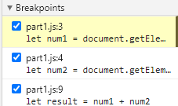
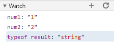
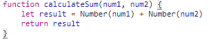

### Debugging
The bug was that result was a string type so when we went to "add" the numbers it would just concat them together.

To fix it, I would wrap num1 and num2 in Number() to force them into numbers as seen:

### Network Tab
1) citylots.json
2) part2.js initiated the download
3) 11.7 mb
4) 14.57ms
5) Mozilla/5.0 (Windows NT 10.0; Win64; x64) AppleWebKit/537.36 (KHTML, like Gecko) Chrome/88.0.4324.104 Safari/537.36
6) Server: Apache
7) Last Modified: Tue, 26 Jan 2021 22:14:13 GMT
8) Content-Type: application/json
